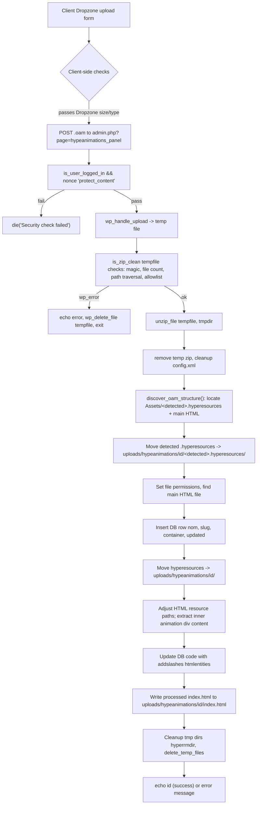

## Copilot instructions for the Tumult Hype Animations WordPress plugin

Purpose: give an AI coding agent the minimum, high-value context to be immediately productive editing this plugin.

- Project type: WordPress plugin (single-plugin PHP codebase). Primary code lives in the `includes/` folder; admin UI is implemented in `includes/adminpanel.php`.
- Textdomain: `tumult-hype-animations`. Translation files are in `languages/` (`*.po`, `*.mo`, `*.pot`).

What matters (big picture)
- This plugin stores uploaded Tumult Hype .OAM archives under the WordPress uploads folder at `wp_upload_dir()['basedir'] . '/hypeanimations/'`.
- Filenames with spaces or special characters are accepted; the server calls `discover_oam_structure()` to locate the actual `.hyperesources` folder and companion HTML file before normalizing directory names.
- The admin UI (upload/replace/delete) plus shortcodes live in `includes/adminpanel.php` and `includes/shortcode.php`.
- Upload handling and sanitization are done server-side: `WP_Filesystem()`, `unzip_file()`, custom `is_zip_clean()` checks, `delete_temp_files()` and `hyperrmdir()` helpers.
- Front-end rendering logic in `includes/shortcode.php` rewrites embedded resource URLs to match the detected `.hyperesources` directory and falls back to a dynamic handler when a static `index.html` is missing.
- Database table access uses the `$wpdb` global and a plugin table referenced via `$hypeanimations_table_name` (set in other include files). CRUD operations for animations are in `includes/adminpanel.php`.

Key patterns & conventions (concrete, searchable)
- Nonces: several actions use explicit nonces. Look for names: `protect_content`, `upload_check_oam` (form field), `hypeanimations_getcontent_nonce`, `hypeanimations_updatecontainer`. Always verify nonces with `wp_verify_nonce()` before mutating.
- AJAX handlers: implemented with `add_action('wp_ajax_...')`. Examples: `hypeanimations_updatecontainer`, `hypeanimations_getanimid`, `hypeanimations_getcontent`. They expect sanitized inputs and return JSON or raw HTML.
- Sanitization: the code prefers `sanitize_text_field()` and `esc_attr()` for inputs/outputs. When updating DB, SQL is built with `$wpdb->prepare()` or `$wpdb->query($wpdb->prepare(...))`. Helper `sanitize_html_classname()` is used before persisting container class names, and rendering-time uses `sanitize_html_class()` to keep shortcode output safe.
- File checks: `is_zip_clean()` verifies ZIP magic bytes, limits file count, checks for path traversal (`..`) and uses an allowlist of extensions defined in the same file. If `is_zip_clean()` returns WP_Error, reject upload and delete temporary file.
- Structure detection: `discover_oam_structure()` inspects `Assets/` inside extracted archives to find the correct `.hyperesources` directory and its matching HTML file, handling spaces and special characters before any renames occur.
- Client-side upload: Dropzone is used in the admin UI. The Dropzone config is in `includes/adminpanel.php` (acceptedFiles: `.oam`, `maxFilesize`, and an `accept` callback that allows filenames with spaces). Path normalization happens on the server after extraction using `discover_oam_structure()`.

Important files to inspect when changing behavior
- `includes/adminpanel.php` — core admin workflows (uploading, replacing, deleting, HTML extraction, AJAX handlers).
- `includes/functions.php` — likely contains utility helpers used by admin (search here when you need helper logic).
- `includes/shortcode.php` — output/rendering and how stored animation HTML is embedded on front-end.
- `includes/variables.php` and `includes/init.php` — bootstrap, global vars (e.g. `$hypeanimations_table_name`), and hooks registration.
- `css/`, `js/`, `assets/` — static assets used by the admin UI (DataTables + Dropzone + styles).

Developer tooling & workflows (what I found)
- Coding standards: vendor contains PHP_CodeSniffer and WP Coding Standards (`vendor/wp-coding-standards/` and `vendor/bin/phpcs`). Use the shipped phpcs to lint plugin PHP against WP standards when making changes.
- Local development: repository is commonly hosted under a LocalWP path in the workspace; plugin expects to run inside a WordPress installation. Use your local WordPress environment to exercise uploads, AJAX and shortcodes.
- Tests: there is a `tests/` folder with `mocks/`. No PHPUnit harness was obvious in the repo root; add tests carefully and mimic existing mocks. If you add CI, wire up `vendor/bin/phpunit` if you add a PHPUnit dependency.
- Translations: see `LANGUAGES.md` and the VS Code task “Compile translation .po -> .mo” to rebuild binary catalogs after editing `.po` files.

Concrete examples to copy or follow
- Add a nonce check in AJAX handlers:
  - `if (!wp_verify_nonce($_POST['_wpnonce'], 'hypeanimations_updatecontainer')) { wp_send_json(['response'=>'nonce_verification_failed']); exit; }`
- Sanitize AJAX inputs before DB operations:
  - `$post_container = sanitize_text_field($_POST['container']);`
  - Use `preg_replace('/[^a-zA-Z0-9_-]/','', $value)` for classnames (a helper `sanitize_html_classname()` exists in-file).
- ZIP validation: follow `is_zip_clean()` implementation — check magic bytes, limit number of files, block path traversal and disallowed extensions using the in-file allowlist.

When editing files, be careful about:
- Preserving WP nonces and user capability checks (`current_user_can('edit_posts')` or `is_user_logged_in()` where used).
- Not breaking the expected OAM extraction flow: code expects `Assets/<name>.hyperesources` and an HTML file inside `Assets/` — renames and copying assume that layout.
- Output encoding: stored snippet uses `addslashes(htmlentities($agarder1))` — when changing how HTML is stored or returned, ensure front-end rendering still works and that `html_entity_decode()` is used when returning content in AJAX.

Additions and small improvements the repo accepts
- There are helper functions `delete_temp_files()` and `is_zip_clean()` already implemented; prefer reusing these.
- `discover_oam_structure()` and `sanitize_html_classname()` centralize structure detection and container sanitization—leverage them instead of reimplementing logic.
- Use `wp_send_json()` for JSON responses in AJAX handlers to keep responses consistent.

If you need more context
- Open `includes/init.php` and `includes/variables.php` to confirm table name, plugin version and any constants.
- Inspect `includes/shortcode.php` to see front-end output expectations (container types: `div` or `iframe`, containerclass usage).

Notes about missing or non-discoverable items
- No CI config or CONTRIBUTING.md was found; assume maintainer uses local WP + vendor tools for linting. If you plan to add CI, use `vendor/bin/phpcs` and a WordPress-compatible PHPUnit setup.

If this file is out-of-date or you want more detail, tell me which part (security, uploads, AJAX, or tooling) to expand.

## Upload flow diagram (detailed)

Below are both a compact diagram and a very detailed, step-by-step mapping of the upload pipeline implemented in `includes/adminpanel.php`. Use this to trace behavior, add instrumentation, or harden security.

Textual, step-by-step flow (very detailed):

1. Client-side
  - Upload form uses Dropzone (see `includes/adminpanel.php` JS). Dropzone config: accepts `.oam`, maxFilesize, timeout.
    - Client `accept` callback allows filenames with spaces and immediately calls `done();` — the server discovers the actual resource folder names after extraction.

2. Request arrival (server-side handler in `hypeanimations_panel_upload()` in `includes/adminpanel.php`)
  - Preconditions: request must be from a logged-in user (`is_user_logged_in()`) and include `$_FILES['file']`.
  - Nonce verification: `$_POST['upload_check_oam']` is verified with `wp_verify_nonce($nonce, 'protect_content')`. If verification fails, execution stops (die).

3. Initial upload handling
  - `wp_handle_upload()` is used with `'test_form' => false` and a MIME allowlist mapping for `.oam`.
  - If `wp_handle_upload()` returns `['error']`, the error is echoed and request exits.
  - The returned path is stored in `$uploadfile` (temporary ZIP/OAM file path).

4. ZIP safety checks: `is_zip_clean($uploadfile, ...)`
  - Implemented in the same file. Key checks:
    - File is readable and size > 0.
    - ZIP magic bytes are validated (`PK\003\004`).
    - Zip archive can be opened by `ZipArchive`.
    - Reject if number of files > 1000 (throttle resource exhaustion).
    - For each file: reject path traversal (`..`), collect file extensions and verify against the allowlist produced by `get_flat_allowlist()`.
    - Verify OAM structure: presence of `Assets/` + at least one `.html` inside.
  - On failure returns `WP_Error`; the caller echoes the message and deletes the uploaded zip via `wp_delete_file($uploadfile)`.

5. Unzip and temporary working directory
  - `WP_Filesystem()` is called; `$uploaddir` defaults to `wp_upload_dir()['basedir'] . '/hypeanimations/tmp/'`.
  - `unzip_file($uploadfile, $uploaddir)` is used. On success the server deletes the original zip file and any `config.xml` found in the root of the extracted folder.

6. Structure discovery & normalization
  - `discover_oam_structure()` scans the extracted `Assets/` directory, returning the detected `.hyperesources` folder, the main HTML file, and the HTML base name while defending against path traversal.
  - The original filename (minus `.oam`) is preserved for display, while folder names are normalized via `basename()` on the discovered value; any discovery failure returns a `WP_Error` early.

7. Permissions & HTML detection
  - Recursively set `0644` file permissions for files inside the `Assets/` folder.
  - Reuse the HTML filename reported by `discover_oam_structure()` for later processing.

8. Database insertion and id generation
  - Before moving files to final location, the plugin inserts a DB row into `$hypeanimations_table_name` with fields: `nom => $original_name`, `slug => sanitize_title($original_name)`, `code => ''`, `updated => time()`, `container => 'div'`.
  - `$lastid = $wpdb->insert_id` is captured for use as final storage directory name, and `wp_mkdir_p()` ensures the destination folder exists.

9. Move and restructure resource files
  - Using the discovered folder name, the server attempts to `rename()` the `.hyperesources` directory directly into `uploads/hypeanimations/<id>/<detected>.hyperesources/`.
  - If the rename fails, it falls back to creating the destination and recursively copying contents before deleting the temporary source to avoid orphaned files.

10. Extract and rewrite HTML snippet
  - Load the discovered HTML file from `Assets/` and replace occurrences of the original `.hyperesources` reference with the public upload URL, using `rawurlencode()` so web paths match filesystem folder names.
  - Capture the first animation `
...
` block line by line and store it in memory for database persistence.

11. Persist snippet and copy index.html
  - The captured snippet is stored in the DB using `addslashes(htmlentities($animation_container))` via `$wpdb->update()`.
  - The processed HTML content is saved to `index.html` inside the final animation directory with `file_put_contents($final_dir . 'index.html', $html_content);`, ensuring iframe renders have a static entry point.

12. Cleanup
  - Remove temporary HTML and Assets folder in tmp if they exist (`wp_delete_file()`, `hyperrmdir()`, `delete_temp_files($uploaddir)`).
  - On success the handler echoes the new ID (`echo $lastid;`) and exits. On failures, the code echoes an error string intended for Dropzone to surface to the user.

13. Edge cases and additional notes
  - Filenames with spaces: uploads are allowed. Original names are preserved for display, while `discover_oam_structure()` and server-side sanitation ensure filesystem paths remain safe during both create and replace flows.
  - Encoding: HTML snippet is stored with `htmlentities()` and `addslashes()`; when fetched via AJAX `hypeanimations_getcontent()` it calls `html_entity_decode()` before returning to the caller.
  - Permissions: uploaded/copy operations use `chmod(..., 0644)` and `mkdir(..., 0755)`; target environment must allow PHP to write into `wp-content/uploads`.
  - Security: all mutating AJAX endpoints verify nonces and current user capabilities. Keep that pattern when adding new endpoints.

Mapping quick-reference (code → step):
 - Client checks: Dropzone config in `includes/adminpanel.php` (accepts `.oam`, allows spaces, enforces max size/timeout).
 - Entry & nonce: `hypeanimations_panel_upload()` in `includes/adminpanel.php`.
 - Upload handling: `wp_handle_upload()` call in `hypeanimations_panel_upload()`.
 - ZIP checks: `is_zip_clean()` (defined in `includes/adminpanel.php`).
 - Unzip: `unzip_file()` followed by `WP_Filesystem()` and `delete_temp_files()`.
 - DB insert/update: `$wpdb->insert()` and `$wpdb->update()` calls in `includes/adminpanel.php`.
 - HTML extraction & storage: `$agarder1` creation and `addslashes(htmlentities($agarder1))`.

If you'd like, I can convert the mermaid diagram into an image and add it to `assets/` or add a small unit/integration test that mocks an OAM upload and validates `is_zip_clean()` and the DB row insertion. Which would you prefer?

